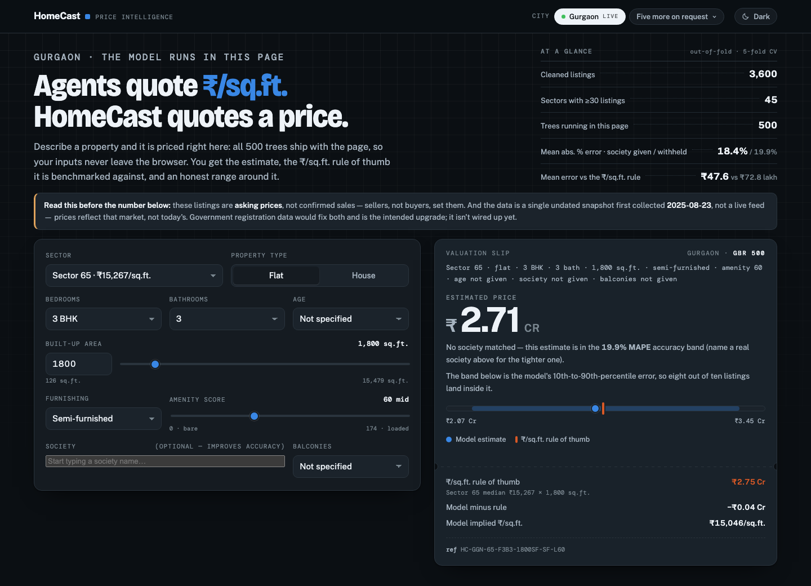

# HomeCast

Residential property price intelligence for Indian cities. A gradient-boosted
valuation model trained on real listing data, shipped as an installable
package with a CLI, plus a static dashboard where the same model runs
entirely in the visitor's browser.

**[Live dashboard](https://safdar-hussain1.github.io/homecast/)** — Gurgaon is live today; the city registry is built so more cities plug in.



## What it does

- **Estimator** — `homecast predict` takes a sector, property type, bedrooms,
  bathrooms, area, furnishing, and luxury score, and returns a point estimate
  in ₹ crore plus an 80% uncertainty band.
- **CLI** — one tool covers the full pipeline: `clean` (raw listings →
  cleaned dataset), `train` (fit the model, write metrics + a dashboard
  export), `evaluate` (cross-validated metrics only, no artifacts written),
  `predict` (price a single property), and `export-dashboard` (regenerate the
  browser-side model file from an already-trained model).
- **Per-city pipeline** — every city is a `City` entry in a small registry
  (`src/homecast/cities.py`) pointing at its raw CSV, cleaned CSV, and model
  directory, plus a cleaning function registered in `PIPELINES`. Gurgaon is
  the first city; adding another is described below.

## Quickstart

Requires Python 3.10+.

```bash
git clone https://github.com/safdar-hussain1/homecast.git
cd homecast

python3 -m venv .venv
source .venv/bin/activate      # Windows: .venv\Scripts\activate

pip install -r requirements.txt   # pinned environment that reproduces the numbers
pip install -e .                  # then the package itself

homecast train --city gurgaon
```

`requirements.txt` is the reproducing environment: install it *before*
`pip install -e .` so pip resolves those versions rather than the looser
floors in `pyproject.toml`. The package's own floors are deliberately loose so
it stays installable on older stacks — but on a materially different
scikit-learn version the metrics can move in the last decimal or two. Every
number published in this README and in the model card was produced with:

| Library | Version |
|---|---|
| Python | 3.12.13 |
| pandas | 3.0.3 |
| NumPy | 2.5.1 |
| scikit-learn | 1.9.0 |
| SciPy | 1.18.0 |
| joblib | 1.5.3 |
| Matplotlib | 3.11.0 |

Output:

```
                             MAE (lakh)   MAPE %     R2
HomeCast model                     47.6     18.4  0.825
  ...without a society given       51.7     19.9  0.811
Sector-median baseline             72.8     26.6  0.653
Global-median baseline            114.9     38.1  0.299
Artifacts -> .../models/gurgaon
```

The second row is not a footnote — it's the number most visitors actually get.
The model is trained on a society (housing project) name as one of its
strongest features, but the CLI/dashboard don't require one, so **whichever
row applies to what you just typed is the honest accuracy for that
prediction**: supply a society and you're in the 18.4% MAPE regime; leave it
blank and you're in the 19.9% regime. See [Society masking](#society-masking)
below for why both numbers exist and ship.

Then price a property:

```bash
homecast predict --city gurgaon --sector "sector 65" --type flat \
  --bhk 3 --bath 3 --area 1800 --furnishing semi-furnished --luxury 60
```

```
Estimated price: Rs 2.71 Cr (range 2.07 - 3.45 Cr)
```

(No `--society` given, so this is priced in the "without a society" regime
above — add `--society "<name>"` for a tighter estimate when you know it.)

Note the `--city` flag comes **after** the subcommand (`homecast train --city
gurgaon`, not `homecast --city gurgaon train`) — each subcommand owns its own
`--city` argument, so a top-level one is rejected by design.

`data/gurgaon/raw/gurgaon_properties.csv` and the cleaned/trained artifacts
under `models/gurgaon/` are committed, so `train` reproduces the numbers
above without needing `clean` first (it runs `clean` automatically if the
cleaned CSV is missing). Run `homecast clean --city gurgaon` directly to see
the row-by-row cleaning log.

## Results

5-fold cross-validation, out-of-fold predictions, n = 3,600. Two rows for the
model, not one — see [Society masking](#society-masking):

| Model                             | MAE (lakh) | MAPE (%) | R²    |
|------------------------------------|-----------:|---------:|------:|
| HomeCast model — society given     |      47.6  |    18.4  | 0.825 |
| HomeCast model — society not given (the default) | 51.7 | 19.9 | 0.811 |
| Sector-median ₹/sqft rule          |      72.8  |    26.6  | 0.653 |
| Global-median ₹/sqft rule          |     114.9  |    38.1  | 0.299 |

The sector-median ₹/sqft rule is the naive baseline an agent uses without a
model: median ₹/sqft for the listing's sector, times the property's area.
The model beats that baseline by roughly a third on MAE even in its harder,
society-unknown configuration.

> **Two things every estimate on this page should be read with:**
>
> 1. **Vintage.** The training data has no date column — it is a single
>    undated snapshot, first committed to this repository on **2025-08-23**.
>    Every number here reflects that market, not today's. There is no
>    mechanism in this project (yet) for detecting or correcting drift since
>    then.
> 2. **Ask vs. transaction.** Every row is a listing's **asking price**, not
>    a price anyone actually paid. The model predicts what a seller would
>    ask, not what a buyer would pay — in the Indian residential market those
>    routinely differ. Government property-registration data (stamp-duty /
>    IGRS records) would fix both of these — a dated, transaction-level
>    source — and is the intended upgrade path; nothing like that is wired up
>    yet.

**The band**: each estimate ships with a range, not just a point. It's the
10th–90th percentile of out-of-fold log-residuals (residual =
`log(pred) − log(actual)`, so `actual = pred × exp(−residual)`), converted to
a multiplicative range: roughly **−23.4% to +27.4%** around the point
estimate (society-given configuration). The percentage range looks lopsided,
but the band is near-symmetric in log space, and exponentiating a symmetric
log interval always yields a wider positive percentage than negative one. The
asymmetry is arithmetic, not a property of the model's errors. Where the
errors really are uneven is across the price range: see the quintile
structure in Methodology.

Model parameters: `n_estimators=500, max_depth=5, learning_rate=0.05,
subsample=0.9, random_state=7`. These are HomeCast's own default parameters
(not scikit-learn's), chosen up front and never tuned against the CV results.

### Society masking

`society_ppsf` (the housing-society/project name, target-encoded as its
median ₹/sqft) is the model's second-biggest feature after `area` — real
signal, worth 14.8% of the trained model's importance. Left alone, that
creates a trap: a model that learns to lean on society is only as good as its
users' ability to supply one, and neither the CLI nor the dashboard requires
it. Measured directly: with society unmitigated, a query that didn't name one
got the plain global-median fallback and **32.95% MAPE** — worse than the
21.4% this whole upgrade was meant to beat — even though the *same* model
scored **17.8% MAPE** in cross-validation when every row supplied its real
society at test time. The gap between those two numbers is entirely an
artefact of the model over-fitting to a feature that, for a normal user, is
simply not there.

The fix, shipped: `SOCIETY_MASK_FRACTION = 0.5` in `src/homecast/model.py`
overwrites `society_ppsf` with the row's own sector rate on ~50% of
*training* rows (seeded, reproducible), teaching the model not to over-rely
on society; at predict time, an unknown/omitted society now falls back to the
sector's rate rather than a flat citywide constant. This degrades gracefully
instead of catastrophically: society-known CV accuracy moves from 17.8% to
18.4% MAPE (worse by 0.5pp — the cost of the masking) but society-unknown
accuracy improves from 32.95% to 19.9% MAPE (dramatically better) — and the
gap between the two regimes shrinks from ~15pp to under 2pp. Both numbers are
reported everywhere HomeCast reports accuracy, honestly, rather than only the
flattering one.

Full detail: [`reports/MODEL_CARD.md`](reports/MODEL_CARD.md).

## Methodology

**Cleaning trail** (`homecast clean --city gurgaon`, logged step by step):

| Step | Rows removed | Rows remaining |
|---|---:|---:|
| Raw feed | — | 3,803 |
| Drop exact duplicate listings | 126 | 3,677 |
| Drop listings without a price | 17 | 3,660 |
| Trim percentile outliers (`price_per_sqft`, `area`; 0.5th–99.5th pct) | 60 | 3,600 |

**Features** (13): `area`, `bedrooms`, `bathrooms`, `is_house`,
`furnishing_code`, `luxury_score`, `age_code`, `sector_ppsf`,
`sector_ppsf_mean`, `sector_ppsf_std`, `sector_count`, `society_ppsf`,
`balcony_code`. The sector and society encodings — median ₹/sqft for the
sector, plus its mean/std/count, and a smoothed-median target encoding for
the society — are the most informative categorical signals, and also the
ones most prone to leaking the target if handled carelessly.

**Fold-safe encoding**: every one of those encodings is *re-learned inside
every training fold* of the 5-fold cross-validation, from that fold's
training rows only, then applied to the held-out fold. Encoding on the full
dataset before splitting would leak information about a listing's own price
(and its neighbors' prices) into the feature used to predict it —
cross-validated error would look better than what the model achieves on
genuinely new listings. Every fold re-fits its own encoding for exactly this
reason. `society_ppsf` additionally goes through the masking described in
[Society masking](#society-masking) above, so its fold-safety and its
graceful-degradation behaviour are both tested.

**CV design**: 5-fold `KFold(shuffle=True, random_state=7)` over all 3,600
listings; predictions are collected out-of-fold, so every metric above is
computed on rows the model never trained on for that prediction. Feature
importances from the trained model (society-given configuration): `area`
0.576, `society_ppsf` 0.148, `bathrooms` 0.080, `sector_ppsf` 0.055,
`is_house` 0.048, `sector_ppsf_mean` 0.035 (remaining seven features share
0.058). These are exported into `models/gurgaon/model.json` as
`feature_importances`, and the dashboard reads them from there rather than
keeping its own copy.

**Error structure by price quintile** (mean signed log-residual, positive =
overestimate; society-given CV configuration): Q1 +0.110 (24.8% MAPE), Q2
+0.022 (15.2%), Q3 +0.008 (14.1%), Q4 −0.016 (17.9%), Q5 −0.088 (19.6%). The
model **overestimates the cheapest listings and underestimates the most
expensive ones**; Q1 also has the worst MAPE of the five quintiles.

## Market findings

From the exploratory analysis (`notebooks/gurgaon_real_estate_eda.ipynb`),
on the cleaned 3,600-listing dataset (2,799 flats, 801 houses):

1. **Two markets in one city** — houses run about 3× the price of flats
   (median flat ₹1.39 Cr vs median house ₹4.25 Cr; citywide median ₹1.54 Cr,
   mean ₹2.51 Cr, max ₹31.5 Cr).
2. **Location is a step function** — sector median prices span roughly 30×
   across the city.
3. **3 BHK dominates supply** — it's the single most common bedroom count by
   a wide margin.
4. **Bathrooms ≈ bedrooms** — the two are nearly interchangeable size
   signals (r ≈ 0.91).
5. **A Simpson's paradox in property age** — in aggregate, old listings look
   like the priciest per sq.ft., but that's only because 58% of old listings
   are houses. Within flats alone, under-construction stock is the priciest
   per sq.ft., not old stock.

## Repo structure

```
data/
  gurgaon/raw/gurgaon_properties.csv        # raw listing snapshot (3,803 rows, third-party data)
  gurgaon/processed/listings_clean.csv      # output of `homecast clean` (3,600 rows)
  DATA_DICTIONARY.md                        # column reference for both files
src/homecast/
  cities.py       # city registry: City dataclass + CITIES dict (public cities only, by default)
  cleaning.py     # cleaning pipeline + PIPELINES registry
  features.py     # feature engineering: fold-local sector/society encoders, balcony
  model.py        # model registry, cross-validated evaluate(), society masking
  valuation.py    # Query -> price estimate, with the uncertainty band
  export.py       # write the browser-side model.json export
  ingest.py       # config-driven ingestion of a third-party CSV, fail-fast unit checks
  reference.py    # rate-based reference calculator (for markets with no listing data)
  cli.py          # `homecast` command line: clean, train, evaluate, predict, ingest, export-dashboard
  plotting.py     # shared plot styling for the notebooks
tests/            # 154 tests covering cities, cleaning, features, model, valuation, export, CLI, ingestion, the reference calculator, and the private/public boundary
notebooks/
  gurgaon_real_estate_eda.ipynb   # exploratory analysis, market findings
  valuation_model.ipynb           # model development, CV, error analysis
scripts/
  build_dashboard.py       # renders docs/index.html from dashboard_template.html + model.json
  dashboard_template.html  # dashboard page template (model runs in-browser)
config/
  amaravathi.rates.example.toml   # public, structurally-fake example rate table (see reference.py)
models/gurgaon/
  model.json      # browser-portable export (tree structure, band, sector/society encodings)
  metrics.json    # CV metrics vs both baselines, both society-known and society-unknown
  model.joblib    # trained sklearn model (gitignored; regenerate with `homecast train`)
docs/index.html    # the built dashboard, served by GitHub Pages
reports/figures/    # exported charts (EDA + model diagnostics)
reports/MODEL_CARD.md
pyproject.toml, requirements.txt, LICENSE
```

`private/` (gitignored, not shown above) holds an additional, non-public
tier — other cities' raw/processed data and models — that never ships in
this repo or the public dashboard build. See "Other cities" below.

## Adding a city

The registry is deliberately small so a new city is a couple of additions,
not a rewrite:

1. Add a `City` entry in `src/homecast/cities.py`'s `CITIES` dict — key,
   display name, and the raw CSV filename (paths for `processed` and
   `models` follow the standard `data/<key>/...` / `models/<key>/`
   convention automatically).
2. Write a cleaning function for that city's raw feed and register it in
   `PIPELINES` in `src/homecast/cleaning.py` — it takes the raw DataFrame and
   returns `(cleaned_df, log_lines)`, same contract as Gurgaon's
   `clean_raw_data`.
3. Run `homecast train --city <key>`. Training, evaluation, feature
   engineering, the CLI, and the dashboard export all key off the registry —
   nothing else needs to change.

## Other cities

**Gurgaon is the only city live in this repo and on the public dashboard.**
Bengaluru, Hyderabad, Mumbai, and a handful of others have been scoped (data
availability, licensing, and unit-convention research) but are not shipped
here — some live in a private, gitignored tier with their own data-quality
bar, others aren't ready. There's no fake "coming soon" chip for them: if you
want another city, ask — **safdar.eryx@gmail.com**.

## Tech stack

Python, pandas, NumPy, scikit-learn, joblib, Matplotlib, Jupyter. The
dashboard's in-browser predictions are plain JavaScript that walks the
exported gradient-boosted trees directly — no ML runtime in the browser. It
matches the Python model to about 1e-14 (tested at 1e-9 tolerance).

## Data and licence

The **code** in this repository is [MIT](LICENSE) licensed.

The **data** is not mine to license. `data/gurgaon/raw/gurgaon_properties.csv`
is a snapshot of residential listings from a public Indian property-listing
portal, redistributed here so the pipeline and every published number can be
reproduced. Nothing in the file or in this repository records which portal it
came from or under what terms it was collected, and I am not going to guess —
treat it as third-party listing content, use it for study and reproduction,
and check the originating portal's terms before any other use. Prices are
asking prices, not transactions. See [`data/DATA_DICTIONARY.md`](data/DATA_DICTIONARY.md)
and [`reports/MODEL_CARD.md`](reports/MODEL_CARD.md).

## License

[MIT](LICENSE) — code only; see the note above for the dataset.
